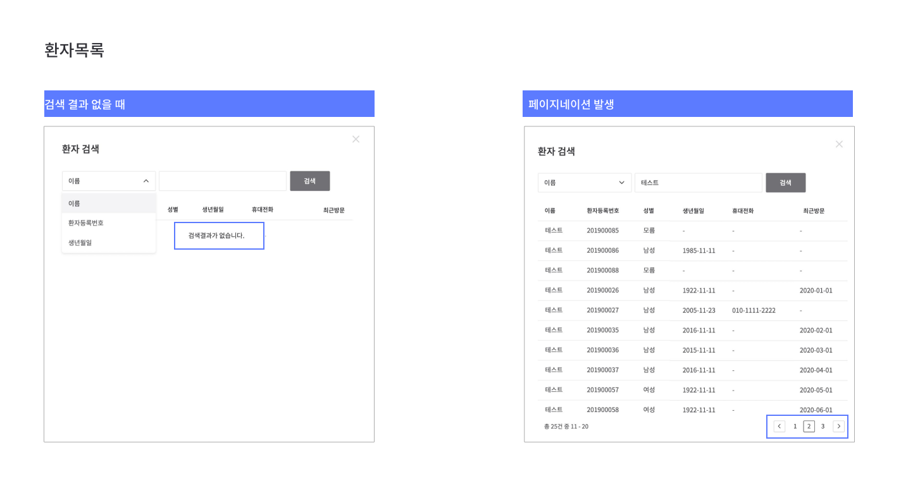
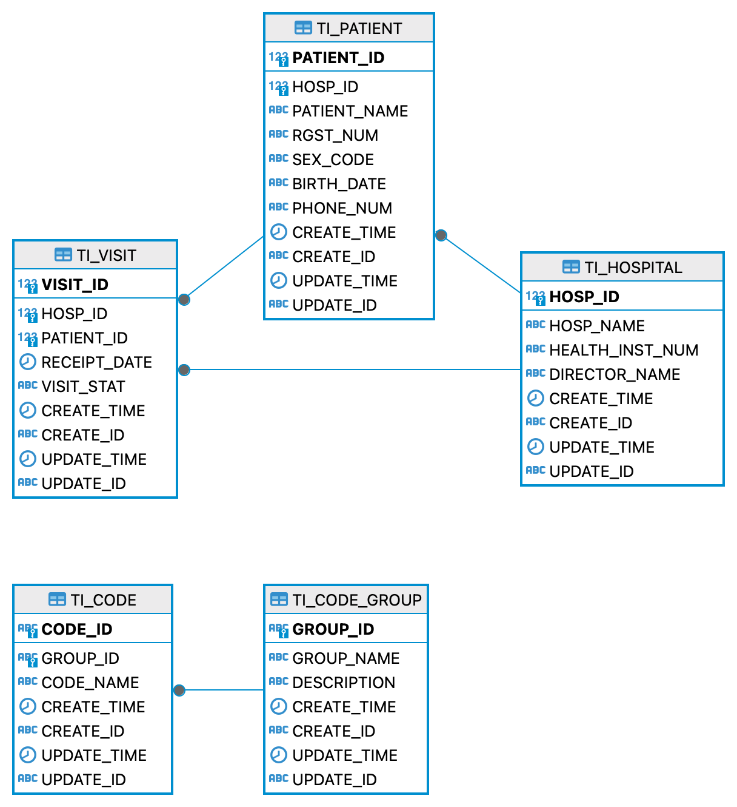

# HDJunction 환자 관리 백엔드 서버
<p align="center">

</p>

환자 관리를 위한 기본적인 기능을 제공합니다.
환자 정보는 병원별로 관리가 가능하며 검색 조건에 따라 조회하고, 추가, 수정, 삭제 기능을 사용할 수 있습니다.

## 목차
* [개요](#개요)
* [프로젝트 소개](#프로젝트-소개)
* [Stacks](#stacks)
* [시작 가이드](#시작-가이드)
* [주요 기능](#주요-기능)
* [화면 기획](#화면-기획)
* [프로젝트 구조](#프로젝트-구조)

## 개요
* 프로젝트 이름 : HDJunction 환자 관리 백엔드 서버
* 프로젝트 개발 기간 : 2024.04.19 ~ 2024.04.24
* 개발 언어 : `Java`
* 데이터베이스 엔진 : `H2`
* 개발자 : 이지연

## 프로젝트 소개
HDJunction에서는 수준 높은 Healthcare IT 서비스를 제공합니다.
의료계 플랫폼을 발전시켜 진료 효율성을 높이고 환자와 의사 사이의 불편함을 해소시켜 모두가 건강한 삶을 살아갈 수 있도록 노력하고 있습니다.

본 프로젝트는 병원 관계자에게 보다 편리하게 환자를 관리할 수 있는 시스템을 제공합니다.
또한 귀사의 비전에 발맞춰 나아가기 위한 초석이 되어 향후 다양한 서비스 개발의 발판이 되기를 희망합니다.

## Stacks
<div> 


</div>

## 시작 가이드
### Requirements
* [openjdk 21.0.2](https://jdk.java.net/21/)

### Installation
```
$ git clone https://github.com/Lee-Jiyeon/hdjunction.git
$ cd docapi
```

### Run Server
```
$ java -jar docapi-0.0.1-SNAPSHOT.jar
```
해당 서버는 루트 폴더 하단에 존재하는 database 폴더 내의 db 파일을 참조하고 있습니다.  
Entity 생성에 실패할 땐 해당 db 파일이 정상적으로 존재하는지 확인해야 합니다.

## 주요 기능
<details style="margin-left:15px; font-size:16px">
<summary>전체 환자 목록 조회</summary>

> 전체 환자 목록을 조회합니다. 방문 정보를 포함하지 않습니다.

* **URL**

  `/api/v1/patient`

* **Method**

  `GET`

* **Response : `객체 리스트`**

  |  이름   |   타입   |    설명     |
  |:-----:|:------:|:---------:|
  | patientId  |  Long  |   환자 id   |
  | hospitalId  |  Long  |   병원 id   |
  | patientName  | String |   환자 이름   |
  | rgstNum  | String | 환자 등록 번호  |
  | sexCode  | String |   환자 성별   |
  | birthDate  | String |  환자 생년월일  |
  | phoneNum  | String | 환자 핸드폰 번호 |

* **Success Response:**
    ```
    [
        {
            "patientId": 1,
            "hospitalId": 1,
            "patientName": "김철수",
            "rgstNum": "202400001",
            "sexCode": "M",
            "birthDate": "1991-12-31",
            "phoneNum": ""
        }
    ]
    ```
</details>
<details style="margin-left:15px; font-size:16px">
<summary>특정 환자 정보 조회</summary>

> 환자 id로 환자 정보를 조회합니다. 방문 정보를 포함하지 않습니다.

* **URL**

  `/api/v1/patient/{patientId}`

* **Method**

  `GET`

* **Response : `단일 객체`**

  |  이름   |   타입   |    설명     |
  |:-----:|:------:|:---------:|
  | patientId  |  Long  |   환자 id   |
  | hospitalId  |  Long  |   병원 id   |
  | patientName  | String |   환자 이름   |
  | rgstNum  | String | 환자 등록 번호  |
  | sexCode  | String |   환자 성별   |
  | birthDate  | String |  환자 생년월일  |
  | phoneNum  | String | 환자 핸드폰 번호 |

* **Success Response:**
    ```
    {
        "patientId": 1,
        "hospitalId": 1,
        "patientName": "김철수",
        "rgstNum": "202400001",
        "sexCode": "M",
        "birthDate": "1991-12-31",
        "phoneNum": ""
    }
    ```
</details>
<details style="margin-left:15px; font-size:16px">
<summary>병원에 등록된 전체 환자 정보 조회</summary>

> 병원 id로 병원에 등록된 전체 환자 정보를 조회합니다. 방문 정보를 포함합니다.

* **URL**

  `/api/v1/patient/lookup`

* **Method**

  `GET`

* **Request Header**

  |     이름     |  타입  | 필수 여부 |    설명    |
  |:----------:|:----:|:-----:|:--------:|
  | hospitalId | Long | `필수`  |    병원 id |

* **Request Parameter**

    |     이름     |   타입    | 필수 여부 | 디폴트 값 |      설명      |
    |:----------:|:-------:|:-----:|:-----:|:------------:|
    | name | String  | `선택`  |       |    검색할 이름    |
    | rgstNum | String  | `선택`  |       | 검색할 환자 등록 번호 |
    | birthDate | String  | `선택`  |       | 검색할 환자 생년월일  |
    | pageNo | Integer | `선택`  |   1   |    병원 id     |
    | pageSize | Integer | `선택`  |  10   |    병원 id     |

* **Response : `Page 객체`**
    
    [Page 객체 정보 참고](https://docs.spring.io/spring-data/commons/docs/current/api/org/springframework/data/domain/Page.html)

  |  이름   |      타입       |    설명     |
  |:-----:|:-------------:|:---------:|
  | patientId  |     Long      |   환자 id   |
  | hospitalId  |     Long      |   병원 id   |
  | patientName  |    String     |   환자 이름   |
  | rgstNum  |    String     | 환자 등록 번호  |
  | sexCode  |    String     |   환자 성별   |
  | birthDate  |    String     |  환자 생년월일  |
  | phoneNum  |    String     | 환자 핸드폰 번호 |
    | recentVisitDate |    String     | 최근 방문 일자  |

* **Success Response:**
    ```
    {
       "content": [
          {
             "patientId": 10,
             "hospitalId": 2,
             "patientName": "김갑수",
             "rgstNum": "202300001",
             "sexCode": "M",
             "birthDate": "1960-02-22",
             "phoneNum": "",
             "recentVisitDate": "2024-04-23"
          }
       ],
       "pageable": {
          "pageNumber": 0,
          "pageSize": 1,
          "sort": {
             "empty": true,
             "unsorted": true,
             "sorted": false
           },
          "offset": 0,
          "paged": true,
          "unpaged": false
       },
       "last": false,
       "totalPages": 4,
       "totalElements": 4,
       "first": true,
       "size": 1,
       "number": 0,
       "sort": {
          "empty": true,
          "unsorted": true,
          "sorted": false
       },
       "numberOfElements": 1,
       "empty": false
    }
    ```
</details>
<details style="margin-left:15px; font-size:16px">
<summary>병원에 등록된 특정 환자 정보 조회</summary>

> 병원 id와 환자 id로 병원에 등록된 특정 환자 정보를 조회합니다. 방문 정보를 포함합니다.

* **URL**

  `/api/v1/patient/lookup/{patientId}`

* **Method**

  `GET`

* **Request Header**

  |     이름     |  타입  | 필수 여부 |    설명    |
    |:----------:|:----:|:-----:|:--------:|
  | hospitalId | Long | `필수`  |    병원 id |

* **Response : `단일 객체`**

  |     이름      |       타입       |    설명     |
  |:-----------:|:--------------:|:---------:|
  |  patientId  |      Long      |   환자 id   |
  | hospitalId  |      Long      |   병원 id   |
  | patientName |     String     |   환자 이름   |
  |   rgstNum   |     String     | 환자 등록 번호  |
  |   sexCode   |     String     |   환자 성별   |
  |  birthDate  |     String     |  환자 생년월일  |
  |  phoneNum   |     String     | 환자 핸드폰 번호 |
  |  visitList  | List< Object > |   방문 기록   |

* **Success Response:**
    ```
  {
       "patientId": 10,
       "hospitalId": 2,
       "patientName": "김갑수",
       "rgstNum": "202300001",
       "sexCode": "M",
       "birthDate": "1960-02-22",
       "phoneNum": "",
       "visitList": [
           {
               "visitId": 5,
               "hospitalId": 2,
               "patientId": 10,
               "receiptDate": "2024-04-23T08:34:48.939+00:00",
               "visitStat": "1"
           }
       ]
    }
    ```
</details>
<details style="margin-left:15px; font-size:16px">
<summary>환자 정보 추가</summary>

> 신규 환자를 등록합니다. 환자 등록 번호는 서버에서 자동 생성됩니다.

* **URL**

  `/api/v1/patient`

* **Method**

  `POST`

* **Request Body**

  |  이름   |       타입       | 필수 여부 |    설명     |
  |:-----:|:--------------:|:-----:|:---------:|
  | hospitalId  |      Long      | `필수`  |   병원 id   |
  | patientName  |      String      | `필수`  |   환자 이름   |
  | sexCode  |     String     | `필수`  |   환자 성별   |
  | birthDate  |     String     | `선택`  |  환자 생년월일  |
  | phoneNum  |     String     | `선택`  | 환자 핸드폰 번호 |


* **Response : `Long`**

    생성된 환자 id

* **Success Response:**
    ```
  // 예시입니다.
  14
    ```
</details>
<details style="margin-left:15px; font-size:16px">
<summary>환자 정보 수정</summary>

> 환자 정보를 수정합니다.

* **URL**

  `/api/v1/patient`

* **Method**

  `PATCH`

* **Request Body**

  |  이름   |       타입       | 필수 여부 |    설명     |
  |:-----:|:--------------:|:-----:|:---------:|
  | patientId  |      Long      | `필수`  |   환자 id   |
  | patientName  |      String      | `선택`  |   환자 이름   |
  | sexCode  |     String     | `선택`  |   환자 성별   |
  | birthDate  |     String     | `선택`  |  환자 생년월일  |
  | phoneNum  |     String     | `선택`  | 환자 핸드폰 번호 |


* **Response : `Long`**

  수정된 환자 id

* **Success Response:**
    ```
  // 예시입니다.
  14
    ```
</details>
<details style="margin-left:15px; font-size:16px">
<summary>환자 정보 삭제</summary>

> 환자 id에 따른 환자 정보를 삭제합니다.

* **URL**

  `/api/v1/patient/{patientId}`

* **Method**

  `DELETE`

* **Response : `Void`**

  상태 코드만 반환

* **Success Response:**
    ```
  HTTP/1.1 200 OK
    ```
</details>

## 화면 기획


## 프로젝트 구조
### ERD


### 디렉터리 구조
```
server
└── docapi
    ├── DocapiApplication.java
    ├── config
    │   └── QueryDSLConfig.java
    ├── controller
    │   ├── PatientController.java
    │   └── VisitController.java
    ├── dto
    │   ├── HospitalDto.java
    │   ├── PatientDto.java
    │   ├── SearchDto.java
    │   └── VisitDto.java
    ├── entity
    │   ├── Code.java
    │   ├── Codegroup.java
    │   ├── Hospital.java
    │   ├── Patient.java
    │   └── Visit.java
    ├── exception
    │   ├── ApiExceptionHandler.java
    │   ├── CustomException.java
    │   ├── ErrorCode.java
    │   └── ErrorResponse.java
    ├── repository
    │   ├── HospitalRepository.java
    │   ├── PatientCustomRepository.java
    │   ├── PatientCustomRepositoryImpl.java
    │   ├── PatientRepository.java
    │   ├── VisitCustomRepository.java
    │   ├── VisitCustomRepositoryImpl.java
    │   └── VisitRepository.java
    └── service
        ├── PatientService.java
        └── VisitService.java
```
